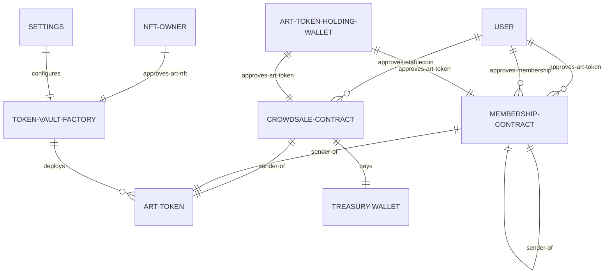

# Co-Museum Contracts

[](https://github.com/co-museum/fractional/actions/workflows/main.yml)
[](https://opensource.org/licenses/MIT)

<h1 align="center">
  <br>
  <a href="https://www.co-museum.com/" target="_blank"></a>
  <br>
  <br>
</h1>

This repository contains the smart contracts for the Co-Museum project.

## Running Local Dev Environment

Running `yarn hardhat node` followed by `yarn deploy-test` should provide you
with a full test environment you can develop/test against.

After that connect to the hardhat network at `http://localhost:8545`, with a
chain ID of `31337`. Input this info into your wallet to connect to the network
and create custom tokens using the addresses produced by the deployment script

Since contract addresses are computed as a function of the deployer's address
and their transaction number, if you start from a clean slate (start a fresh
node and immediately deploy) you should always end up with the same addresses
(such that you only need to take note of them once).

_Make sure you're using one of the accounts specified in `hardhat.config.ts`_

## Contract/User Relationships

Approval, sender (see
[PartiallyPausable](./contracts/lib/PartiallyPausableUpgradeable.sol)) as well
as other relevant relationships between the Co-Museum contracts are laid out in
the following diagram (dynamic relationshops in red):

> - Implementation details are ommited from this diagram.
> - All user approvals must be dynamically requested for
> - Where relationships are through another contract they are indicated with a
>   label suffix such as approves-<em>stablecoin</em>



## Building

```
git clone https://github.com/co-museum/contracts.git co-museum-contracts
cd co-museum-contracts
yarn install
yarn hardhat compile
yarn hardhat <task>
```

## Scripts

```
yarn prettier:format
yarn prettier:check
yarn test
yarn test:coverage
yarn test:gas
yarn deploy:test
```
